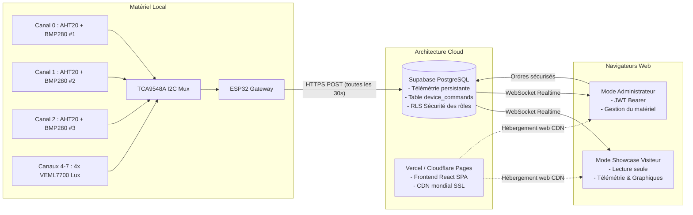

# ESP32 Tower Garden - IoT Supervision, Agronomy & Cloud Dashboard

[](https://react.dev/)
[](https://tailwindcss.com/)
[](https://supabase.com/)
[](https://espressif.com/)
[](LICENSE)

Plateforme IoT complète et moderne pour superviser et contrôler une **Tower Garden**, un système d'agriculture verticale ou une serre intérieure en temps réel.

Le système intègre la télémétrie physique multi-zones sur bus I2C multiplexé, le calcul agronomique en direct du **Déficit de Pression de Vapeur (VPD)** et du **PAR / PPFD** (étalonné sur le profil spectral fixe d'un panneau LED Barrina T8 5000K CRI 98+), des graphiques d'historique avec **Recharts**, et une sécurité granulaire par rôles (Visiteurs en lecture seule vs Admin authentifié).

---

## 🏗️ Architecture Globale & Déploiement Cloud



---

## 🌟 Fonctionnalités Clés

### 🌿 1. Calculs Agronomiques Avancés
* **VPD (Vapor Pressure Deficit) Air & Feuille** :
  * Calculé selon l'équation de saturation de vapeur d'eau d'**Arden Buck** :
    $$SVP(T) = 0.61078 \times \exp\left(\frac{17.27 \times T}{T + 237.3}\right) \quad [\text{kPa}]$$
  * Différenciation $VPD_{\text{air}}$ et $VPD_{\text{leaf}}$ avec curseur interactif de décalage thermique foliaire (par défaut $-1.5^\circ\text{C}$ sous LED).
  * Jauge interactive avec code couleur des 5 zones physiologiques : **Semis/Boutures (0.4-0.8 kPa)**, **Végétatif (0.8-1.05 kPa)**, **Floraison (1.05-1.45 kPa)**, et **Zones de danger (moisissure ou stress)**.
* **Conversion Lux $\rightarrow$ PAR / PPFD ($\mu\text{mol}/(\text{m}^2\cdot\text{s})$)** :
  * Étalonné sur le profil spectral fixe d'un éclairage **Barrina T8 4FT 5000K Daylight White (4x 42W = 168W, CRI 98+)** :
    $$\mathbf{PPFD} = \text{Lux} \times 0.0150 \quad \left(1\,\mu\text{mol}/(\text{m}^2\cdot\text{s}) \approx 66.7\text{ Lux}\right)$$
  * Calcul automatique du **Daily Light Integral (DLI)** en $\text{mol}/(\text{m}^2\cdot\text{jour})$ pour des photopériodes de 12h, 16h et 18h.
  * Les lampes sont à spectre continu fixe non-ajustable ; l'intensité réelle reçue est mesurée en direct par les 4 capteurs VEML7700.

### 📊 2. Graphiques d'Historique Multi-Canaux (Recharts)
* Suivi temporel interactif avec sélection de période (**1h, 6h, 24h, 7 jours**).
* 4 modes de visualisation :
  * **VPD multi-zones** avec bande d'objectif agronomique optimale ombrée.
  * **Températures différentielles** (AHT20 vs BMP280 sur les 3 zones).
  * **Humidité relative**.
  * **Intensité lumineuse PAR / PPFD** sur les 4 étages.

### 🔒 3. Sécurité & Gestion du Matériel
* **Mode Visiteur (Lecture Seule)** : Accès public sécurisé aux données sans possibilité d'actionner les relais.
* **Mode Administrateur Authentifié** : Authentification JWT via fenêtre modale.
* **Module d'Irrigation (En Développement)** : Prévu pour piloter les cycles de pompe dès finalisation du raccordement physique des relais sur l'ESP32.
* **Failsafe Matériel (ESP32)** : Watchdog matériel limitant automatiquement le fonctionnement continu des pompes (max 120s) pour prévenir toute inondation même en cas de coupure réseau.

---

## 📁 Structure du Répertoire

```text
├── firmware/
│   └── esp32_sensor_gateway.ino    # Firmware C++ ESP32 (TCA9548A, AHT20, BMP280, VEML, Supabase REST)
├── frontend/                       # Application Web React 19 + TypeScript + Tailwind CSS v4
│   ├── src/
│   │   ├── components/
│   │   │   ├── VpdGaugeCard.tsx       # Jauge VPD avec diagnostic stomatique
│   │   │   ├── LightSpectrumCard.tsx  # Carte PAR / PPFD et DLI (4 canaux VEML - Barrina T8)
│   │   │   ├── HistoryCharts.tsx      # Graphiques d'historique interactifs Recharts
│   │   │   ├── SensorsGrid.tsx        # Grille des 3 modules physiques AHT20/BMP280
│   │   │   ├── PumpControlCard.tsx    # Statut du module d'irrigation en développement
│   │   │   ├── LightControlCard.tsx   # Statut de l'éclairage fixe Barrina T8 5000K (CRI 98+)
│   │   │   └── LoginModal.tsx         # Fenêtre de connexion sécurisée
│   │   ├── lib/
│   │   │   └── supabase.ts            # Client Supabase & abonnements WebSockets
│   │   ├── utils/
│   │   │   └── agronomy.ts            # Moteur mathématique pur VPD, PPFD et DLI
│   │   └── App.tsx                    # Dashboard principal avec navigation par onglets
├── backend/                        # Backend optionnel C# .NET 10 (Hub SignalR & Broker MQTTnet)
└── supabase_schema.sql             # Schéma SQL pour hébergement Cloud managé
```

---

## 🚀 Démarrage Rapide

### 1. Lancer le Frontend Web en Local
```bash
cd frontend
npm install
npm run dev
```
* Accès à l'interface : `http://localhost:5173/` (ou `http://localhost:4173/` en mode preview build).
* **Identifiants de démonstration Admin** :
  * Utilisateur : `admin`
  * Mot de passe : `SecureAdminPassword123!` (ou `admin`)

### 2. Déployer la Base de Données (Supabase)
1. Créez un projet sur [Supabase](https://supabase.com).
2. Ouvrez l'éditeur SQL et collez le contenu du fichier `supabase_schema.sql`.
3. Récupérez votre `URL` et clé `Anon` dans **Project Settings $\rightarrow$ API**.
4. Renseignez-les dans `frontend/.env` :
   ```env
   VITE_SUPABASE_URL=https://votre-projet.supabase.co
   VITE_SUPABASE_ANON_KEY=votre-cle-anon
   ```

### 3. Flasher le Firmware ESP32
1. Ouvrez `firmware/esp32_sensor_gateway.ino` dans l'Arduino IDE.
2. Installez les bibliothèques `Adafruit AHTX0`, `Adafruit BMP280`, `Adafruit VEML7700` et `ArduinoJson`.
3. Renseignez votre SSID Wi-Fi et les clés Supabase dans les constantes au début du fichier.
4. Téléversez sur votre ESP32 relié au multiplexeur TCA9548A.

---

## 📜 Licence
Projet distribué sous licence MIT.
