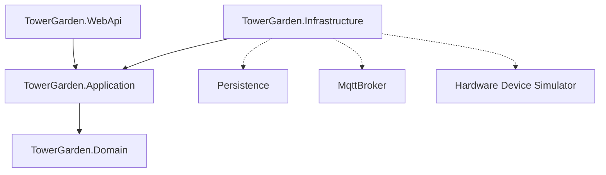

# Tower Garden - IoT Supervision & Control Dashboard

[](https://dotnet.microsoft.com/download)
[](https://react.dev/)
[](https://tailwindcss.com/)
[](https://mqtt.org/)
[](LICENSE)

Une plateforme moderne et hautement sécurisée pour superviser et contrôler une **Tower Garden** hydroponique en temps réel. Le système combine une architecture backend robuste en **C# .NET 10** avec un courtier MQTT embarqué, un simulateur matériel interactif, et une interface frontend web immersive bâtie en **React**, **TypeScript** et **Tailwind CSS**.

---

## 🏗️ Architecture du Projet

Le projet suit les principes de la **Clean Architecture** et les normes de conception **SOLID** pour assurer la maintenabilité, l'extensibilité, et la testabilité du code.



### 📁 Structure des Dossiers

*   **`backend/`** : Solution .NET 10 découpée en couches logiques :
    *   `TowerGarden.Domain` : Entités de domaine (`Pump`, `Light`, `SensorReading`) et règles métiers pures (sans dépendances externes).
    *   `TowerGarden.Application` : Cas d'utilisation (Use Cases), DTOs et interfaces applicatives.
    *   `TowerGarden.Infrastructure` : Persistance en mémoire (thread-safe), courtier MQTT embarqué (`MQTTnet`), client MQTT d'écoute backend et simulateur matériel d'arrière-plan (`BackgroundService`).
    *   `TowerGarden.WebApi` : Contrôleurs REST, liaisons de hubs de communication temps réel (**SignalR**), et middlewares de sécurité.
    *   `TowerGarden.Tests` : Suite complète de tests unitaires xUnit couvrant les règles métiers et la couche de sécurité.
*   **`frontend/`** : Application SPA moderne :
    *   `React` + `Vite` + `TypeScript` + `Tailwind CSS v4`.
    *   Communication bidirectionnelle : API REST pour les commandes de configuration et **SignalR** (WebSockets) pour la télémétrie en temps réel.

---

## 🌟 Fonctionnalités Clés

### 📊 Supervision Temps Réel & Télémétrie
*   Suivi en direct des températures de l'air et de l'eau, de l'humidité relative ambiante et de la luminosité (Lux) sur 4 étages verticaux.
*   Console de journalisation MQTT virtuelle intégrée affichant en temps réel les trames et les commandes échangées sur le réseau local.

### 🚰 Arrosage Automatique & Calendrier
*   **Cycles planifiés** : Définition précise de la durée de marche (secondes) et de l'intervalle de repos (minutes).
*   **Double état intelligent** : Distinction visuelle claire dans l'interface :
    *   *Actif / En marche* : Animation d'écoulement de l'eau active (en vert).
    *   *Actif / En veille* : Indique que le calendrier automatisé est actif mais en repos temporaire (en jaune).
    *   *Désactivé* : Système arrêté (en gris).

### 🚨 Boucle de Sécurité Hydraulique (Anti-Fuite)
*   **Cartographie de la base** : Le réservoir d'eau est surveillé par un interrupteur à flotteur (niveau OK vs critique).
*   **Capteurs de fuites 4 quadrants** : 4 détecteurs d'eau placés aux points cardinaux de la base (**Nord, Est, Sud, Ouest**) surveillent les débordements physiques.
*   **Arrêt d'urgence** : Si l'un des détecteurs signale de l'eau (`true`), le backend déclenche instantanément la boucle de sécurité, force l'arrêt de la pompe, notifie le matériel via MQTT, et affiche une alerte clignotante à l'écran.

### 🔒 Sécurité Conforme aux Bonnes Pratiques OWASP
*   **Authentification JWT** : Signature HMAC-SHA256 forte. La consultation du tableau de bord et des capteurs est accessible publiquement en lecture seule (Read-Only). Le pilotage des actuateurs exige une session administrateur valide.
*   **Prévention contre les attaques d'identification** : Hachage sécurisé des mots de passe (`PBKDF2`) et messages d'erreurs d'authentification génériques (bloque l'énumération de comptes).
*   **Sécurisation MQTT** : Le courtier MQTT embarqué sur le port `1883` valide la signature de connexion de tous les appareils (le simulateur utilise des identifiants dédiés uniques).

---

## 🚀 Démarrage Rapide

### Prérequis
*   [.NET SDK 10](https://dotnet.microsoft.com/download)
*   [Node.js](https://nodejs.org/) (v18 ou supérieur) & `npm`

### 1. Démarrer le Backend & Simulateur
Le backend démarre automatiquement le serveur Web API, le Hub SignalR, le Broker MQTT embarqué, et le simulateur matériel :
```bash
cd backend
dotnet run --project TowerGarden.WebApi/TowerGarden.WebApi.csproj
```
*   **API REST & SignalR** : Écoute sur `http://localhost:5013`
*   **Broker MQTT** : Écoute sur `localhost:1883`

### 2. Démarrer le Frontend React
```bash
cd frontend
npm install
npm run dev
```
*   **Interface Web** : Accès via `http://localhost:5173/`

### 🔑 Identifiants d'Accès de Démo
*   **Compte Admin (Web/REST/SignalR)** :
    *   *Utilisateur* : `admin`
    *   *Mot de passe* : `SecureAdminPassword123!`
*   **Compte Appareil (MQTT)** :
    *   *Utilisateur* : `garden_device`
    *   *Mot de passe* : `SafeDeviceToken556!`

---

## 🧪 Tests Unitaires & Simulation de Fuite

### Exécution des Tests
Pour exécuter la suite complète de 24 tests valider la cohérence du domaine et les failles OWASP :
```bash
cd backend
dotnet test
```

### Tester la Boucle de Sécurité (Simulation de Fuite)
1. Ouvrez `http://localhost:5173/`, connectez-vous avec le compte `admin`.
2. Allumez la pompe à partir de la carte de contrôle.
3. Attendez 15 secondes. Le simulateur matériel détecte que la pompe tourne en continu et simule une fuite sur le capteur **Sud** de la base.
4. Constatez l'arrêt d'urgence instantané de la pompe, l'activation du gyrophare visuel rouge sur le schéma de sol et l'affichage de la bannière de sécurité.
5. Après 12 secondes sans arrosage, le simulateur considère que la base a séché et réinitialise automatiquement le capteur Sud à l'état sec.

---

## 📝 Licence

Ce projet est sous licence MIT. Pour plus de détails, voir le fichier [LICENSE](LICENSE).
